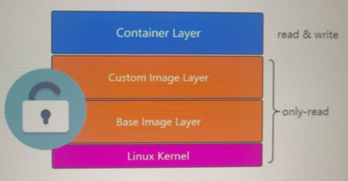

## 1.Docker是什么？

​	[Docker官网](www.docker.com)

> Modernize your applications, accelerate innovation Securely build, share and run modern applications anywhere
>
>  *实现应用程序现代化，加速创新 安全构建、共享和运行任何地方的现代应用程序* 

​	[Docs](https://docs.docker.com/get-started/)

> Docker is a platform for developers and sysadmins to **build, share, and run** applications with containers. The use of containers to deploy applications is called *containerization*. Containers are not new, but their use for easily deploying applications is.
>
> *Docker 是开发人员和系统管理员使用容器[构建、共享和运行]应用程序的平台。**使用容器来部署应用程序称为 [容器化]。**容器不是新的，但它们用于轻松部署应用程序。*

## 2.为什么是Docker？

​	我们先来看一段运维的发展史，开发好一个项目，进行线上部署

- 单机部署


单机部署在项目初期固然方便快捷，但是当我们项目访问量变大，业务复杂度增加的时候，这个时候就会暴露出很多缺点：

​	`成本高` `部署慢` `资源浪费``硬件限制``不利于扩展`

- 虚拟化时代


与之前相比，利用虚拟机可以更好地利用资源，相对容易扩展些，但是它同时带来了很多缺点：

​	`初始化占用资源较大` `移植性较差` `资源利用率低`

- 容器化当下


> docker的优势，引用官方的话：
>
> - **Standard:** Docker created the industry standard for containers, so they could be portable anywhere
> - **Lightweight:** Containers share the machine’s OS system kernel and therefore do not require an OS per application, driving higher server efficiencies and reducing server and licensing costs
> - **Secure:** Applications are safer in containers and Docker provides the strongest default isolation capabilities in the industry
> - **标准：** Docker创建了容器的行业标准，因此它们可以在任何地方移植
> - **轻量级：**容器共享计算机的OS系统内核，因此不需要每个应用程序都具有OS，从而提高了服务器效率并降低了服务器和许可成本
> - **安全：**容器中的应用程序更安全，Docker提供了业界最强大的默认隔离功能

## 3.Docker环境搭建

​	在windows上安装centos7，采用Vagrant+Virtual Box：

- Vagrant安装：


```shell
#1.访问vagrant官网
https://www.vagrantup.com
#2.点击Downloads，下载windows及对应版本
#3.next安装
#4.命令行输入vagrant 测试是否安装成功
```

- Virtual Box安装：


```shell
#1.访问VirtualBox官网 
https://www.virtualbox.org/ 
#2.点击Downloads，下载windows及对应版本
#4.next安装 
#注意事项：(我在安装的时候没有遇到哦)
[win10中若出现]安装virtualbox快完成时立即回滚，并提示安装出现严重错误 
	1)打开服务 
	2)找到Device Install Service和Device Setup Manager，然后启动
	3)再次尝试安装
```

- 安装centos

```shell
#1.创建docker-centos7文件夹(注意目录路径不要有中文字符)，进入文件夹 
#2. 在此目录下打开cmd(或者powershell)，运行vagrant init centos/7 此时会在当前目录下生成Vagrantfile
#3 准备centos7的box （也可以运行vagrant up 此时会找centos7的镜像，本地有就用本地的，本地没有就会拉取远端的，但是直接拉去远端太慢，建议先下载后从本地拉取）
	1)下载地址：https://pan.baidu.com/s/1fKylFndofc77zFWCUjBo8w 下载完成后放入上述新建的文件夹中
	2)vagrant box add centos/7 XX\virtualbox.box (你存放的地址)	
	3)vagrant box list 查看本地的box(这时候可以看到centos/7)
	4)vagrant up (根据本地的centos7 box创建虚拟机。打开virtual box，可以发现centos7创建成功)
#4. vagrant基本操作
	1)vagrant ssh 进入刚才创建的centos7中
    2)vagrant status 查看centos7的状态 
    3)vagrant halt 停止centos7 
    4)vagrant destroy 删除centos7 
    5)vagrant status 查看当前vagrant创建的虚拟机 
#5.修改虚拟机属性配置文件Vagrantfile之后执行vagrant reload
	config.vm.box = "centos/7"
	config.vm.network "public_network"
	config.vm.provider "virtualbox" do |vb|
		   vb.memory="3000"
		   vb.name  ="alvin-centos7"
		   vb.cpus   = 2
	end
	
```

基于上述vagrant+virtual box+centos的安装步骤， 我们已经可以安装docker了，但是windos命令窗口对于我们来说不是很友好，所以我们选择xshell6的安装

- xshell 登录

```shell
#1.查看centos7的基本信息，主要获取Hostname Port IndentityFile信息
vagrant ssh-config 

#2.进入虚拟机查看其ip地址,复制其ip地址192.168.110.164
vagrant ssh 
ip a
#3.使用root账户登录
	sudo -i	
	vi /etc/ssh/sshd_config	
	修改PasswordAuthentication yes
	修改root密码 passwd 
	systemctl restart sshd
#4.连接xshell
	使用root账户+刚才修改的密码进行登录。
```

- 实现box分发

  在安装docker之前，我们有必要再来了解下，virtual.box的分发，以保证我们可以快速在新创建一个虚拟机。

```shell
#1.回到我们上述的docker-centos目录
#2.退出虚拟机 vagrant halt
#3.执行vagrant package --output docker.centos7.box
#4.将上述执行结果docker-centos7.box添加到其他的vagrant环境中（注意:此时要新建一个目录，用来存放docker-centos7.box,然后进入到该目录下）
	vagrant box add docker-centos7 docker-centos7.box
#5.执行vagrant init docker-centos7 得到vagrantfile
#6.执行vagrant up就会发现启动了一个新的虚拟机。
```

- 安装Docker

> 官网说明： https://docs.docker.com/install/linux/docker-ce/centos/ 

```shell
#1.win+r打开命令窗口,执行cmd
#2.切换到docker-centos目录，执行vagrant up命令打开虚拟机（因为此时重启电脑了，虚拟机需要重新打开）
#3.使用xhsell登录虚拟机。
#4.执行以下命令：
	sudo yum remove docker \
                  docker-client \
                  docker-client-latest \
                  docker-common \
                  docker-latest \
                  docker-latest-logrotate \
                  docker-logrotate \
                  docker-engine
	sudo yum install -y yum-utils \
  		 device-mapper-persistent-data \
  		 lvm2
#5.为了拉取镜像快速，可以登录自己的阿里云服务器->选择控制台->容器镜像服务->镜像中心->镜像加速器
	sudo mkdir -p /etc/docker
	sudo tee /etc/docker/daemon.json <<-'EOF'
	{
  	"registry-mirrors": ["https://gys4eox1.mirror.aliyuncs.com"]
	}
	EOF
	#(这个是免费的哦~)
	sudo systemctl daemon-reload
	sudo systemctl restart docker
#6.正式安装docker
	sudo yum install docker-ce docker-ce-cli containerd.io
#7.启动Docker
	sudo systemctl start docker
	sudo systemctl enable docker(设置开机启动)
	docker version --查看docker版本信息
```

## 4.Docker应用场景

> www.docker.com ---> Solutions

```shell
#1.有助于微服务的落地和部署
#2.充分利用物理机资源，同时能够整合服务器资源
#3。提高开发效率，测试效率，部署效率，有利于DevOps的落地，CI/CD(持续集成)
#4.云原生落地，应用更好地迁移
...
```

## 5.Docker核心

### Docker Engine

*Docker Engine* is a client-server application with these major components:

- A server which is a type of long-running program called a daemon process (the `dockerd` command).
- A REST API which specifies interfaces that programs can use to talk to the daemon and instruct it what to do.
- A command line interface (CLI) client (the `docker` command).

> *Docker Engine*是具有以下主要组件的客户端-服务器应用程序：
>
> - 服务器是一种长期运行的程序，称为守护程序进程（ `dockerd`命令）。
> - REST API，它指定程序可以用来与守护程序进行通信并指示其操作的接口。
> - 命令行界面（CLI）客户端（`docker`命令）。


### Docker Architecture

 Docker uses a client-server architecture. The Docker *client* talks to the Docker *daemon*, which does the heavy lifting of building, running, and distributing your Docker containers. The Docker client and daemon *can* run on the same system, or you can connect a Docker client to a remote Docker daemon. The Docker client and daemon communicate using a REST API, over UNIX sockets or a network interface. 

>  Docker使用客户端-服务器架构。Docker *客户端*与Docker *守护进程*进行对话，该*守护进程*完成了构建，运行和分发Docker容器的繁重工作。Docker客户端和守护程序*可以* 在同一系统上运行，也可以将Docker客户端连接到远程Docker守护程序。Docker客户端和守护程序在UNIX套接字或网络接口上使用REST API进行通信。 


### Docker Images  and Containers

 A Docker container image is a lightweight, standalone, executable package of software that includes everything needed to run an application: code, runtime, system tools, system libraries and settings. A container is a standard unit of software that packages up code and all its dependencies so the application runs quickly and reliably from one computing environment to another. Container images become containers at runtime and in the case of Docker containers- images become containers when they run on Docker Engine.

 Fundamentally, a container is nothing but a running process, with some added encapsulation features applied to it in order to keep it isolated from the host and from other containers. One of the most important aspects of container isolation is that each container interacts with its own, private filesystem; this filesystem is provided by a Docker **image**. An image includes everything needed to run an application -- the code or binary, runtimes, dependencies, and any other filesystem objects required. 

>  Docker容器映像是轻巧的，独立的，可执行的软件软件包，其中包含运行应用程序所需的一切：代码，运行时，系统工具，系统库和设置。 容器是打包代码及其所有依赖项的软件的标准单元，因此应用程序可以从一个计算环境快速可靠地运行到另一个计算环境  容器映像在运行时成为容器，对于Docker容器，映像在容器[Docker Engine](https://www.docker.com/products/docker-engine)上运行时成为容器。 
>
>  从根本上说，一个容器不过是一个正在运行的进程，并对其应用了一些附加的封装功能，以使其与主机和其他容器隔离。容器隔离的最重要方面之一是每个容器都与自己的私有文件系统进行交互。该文件系统由Docker **映像提供**。映像包括运行应用程序所需的所有内容-代码或二进制文件，运行时，依赖项以及所需的任何其他文件系统对象。 

###  Containers and virtual machines 

A container runs *natively* on Linux and shares the kernel of the host machine with other containers. It runs a discrete process, taking no more memory than any other executable, making it lightweight.

By contrast, a **virtual machine** (VM) runs a full-blown “guest” operating system with *virtual* access to host resources through a hypervisor. In general, VMs incur a lot of overhead beyond what is being consumed by your application logic.

> 容器在Linux上*本地运行*，并与其他容器共享主机的内核。它运行一个离散进程，不占用任何其他可执行文件更多的内存，从而使其轻巧。
>
> 相比之下，**虚拟机**（VM）运行成熟的“来宾”操作系统，并通过虚拟机管理程序对主机资源进行*虚拟*访问。通常，VM会产生大量开销，超出了应用程序逻辑所消耗的开销。


## 6.Docker使用

上面说了那么多，那们我们有了Docker，怎么使用了？不妨用docker来安装一些基本的application试试。

- Docker初体验

```shell
#创建tomcat容器
	docker pull tomcat
	##启动tomcat
	docker run -d --name my-tomcat -p 9090:8080 tomcat
#创建mysql容器
	docker run -d --name my-mysql -p 3301:3306 -e MYSQL_ROOT_PASSWORD=alvin123 --privileged mysql
#进入到容器内部
	docker exet -it containerid /bin/bash
	
```

那我们这些容器镜像到底是从哪里拉取的呢？

> [ https://hub.docker.com/ ]( https://hub.docker.com/ )

- Docker常用命令

```shell
#1.查看本地Docker镜像
	docker images
#2.拉取镜像
	docker pull
#3.创建容器
	docker run
#4.查看当前正在运行的容器
	docker ps
#4.查看所有运行过的容器
	docker ps -a
```

## 7.Docker设计猜想

> 分层思想



以上就是docker本尊的基础信息啦，下次我们将对docker进行灵魂拷问，欢迎来看~